# CDR to Vector Latent Tensor Pipeline

[](https://www.python.org/downloads/)
[](https://opensource.org/licenses/MIT)

> **A robust ETL pipeline for converting proprietary CorelDRAW (.cdr) files into normalized tensor representations suitable for machine learning applications.**

## 📋 Table of Contents

- [Overview](#overview)
- [Features](#features)
- [Architecture](#architecture)
- [Installation](#installation)
- [Quick Start](#quick-start)
- [Usage](#usage)
- [Configuration](#configuration)
- [Project Structure](#project-structure)
- [Pipeline Stages](#pipeline-stages)
- [API Documentation](#api-documentation)
- [Examples](#examples)
- [Troubleshooting](#troubleshooting)
- [Contributing](#contributing)
- [License](#license)
- [Author](#author)

## 🎯 Overview

This pipeline implements a complete Extract-Transform-Load (ETL) workflow designed specifically for **Architecture C (Vector-Latent Diffusion)** systems. It converts proprietary CorelDRAW (.cdr) archives into normalized, fixed-dimensional tensors suitable for training Variational Autoencoders (SVG-VAE) and other machine learning models.

### Key Objectives

- **Format Conversion**: Bridge proprietary binary .cdr files to standardized SVG format
- **Semantic Understanding**: Classify vector paths by purpose (cut lines, crease lines, etc.)
- **Mathematical Normalization**: Convert diverse geometric primitives into uniform representations
- **ML-Ready Output**: Generate fixed-dimensional tensors suitable for deep learning

## ✨ Features

### Core Capabilities

- **🔄 Headless Extraction**: Leverages Inkscape CLI for reliable CDR→SVG conversion
- **🎨 Semantic Layering**: Intelligent filtering of cut vs. crease lines based on stroke colors
- **📐 Geometric Canonicalization**: Converts all primitives (lines, arcs, quadratics) to uniform cubic Bézier curves
- **📊 Tensor Serialization**: Outputs ready-to-train `.pt` (PyTorch) or `.npy` (NumPy) tensors
- **⚙️ Configurable Processing**: YAML-based configuration for flexible pipeline customization
- **📝 Comprehensive Logging**: Detailed logging for debugging and monitoring
- **🛡️ Error Handling**: Robust error recovery and validation at each pipeline stage

### Technical Highlights

- Preserves affine transformations during conversion
- Scale-invariant normalization to [0,1]² unit square
- Fixed-length tensor output with smart padding/truncation
- Batch processing support for multiple files
- Aspect ratio preservation options

## 🏗️ Architecture

The pipeline operates in **four distinct phases**:

```mermaid
graph LR
    A[Raw .cdr Files] -->|Inkscape CLI| B[Raw SVG]
    B -->|Filter & Parse| C[Semantic SVG]
    C -->|Math Canonicalization| D[Normalized Béziers]
    D -->|Serialization| E[Latent Tensors Nx14]
```



### Phase Breakdown

#### 1️⃣ Headless Extraction
Uses Inkscape's rendering engine to preserve affine transformations and avoid reverse-engineered parsers.

#### 2️⃣ Semantic Filtering
Parses the SVG XML tree to isolate structural elements:
- **Cut Lines**: Identified by spot colors (Magenta/Red) or specific layer IDs
- **Crease Lines**: Identified by spot colors (Cyan/Blue)
- **Ignored Elements**: Text, raster images, fill patterns

#### 3️⃣ Mathematical Canonicalization
Converts mixed primitives to uniform cubic Bézier curves:

| Primitive | Conversion Method |
|-----------|-------------------|
| **Line** | $P_0=L_0, P_1=\frac{2L_0+L_1}{3}, P_2=\frac{L_0+2L_1}{3}, P_3=L_1$ |
| **Quadratic** | Degree elevation (3 → 4 control points) |
| **Arc** | Split strategy where $\theta \le 90°$ |

**Spatial Normalization Formula:**

$$V_{norm} = \frac{V - \mu}{2s} + 0.5$$

Where:
- $\mu$ = centroid
- $s$ = max dimension for scale invariance

#### 4️⃣ Tensor Serialization
Outputs matrix $\mathbf{X} \in \mathbb{R}^{N_{max} \times 14}$

**Feature Vector** format per row:
```
[sx, sy, cx1, cy1, cx2, cy2, ex, ey, pen_state, is_line, is_curve, is_move, pad1, pad2]
```

## 🚀 Installation

### System Requirements

- **OS**: Linux (Ubuntu 20.04+) or macOS
- **Python**: 3.8 or higher
- **External Tool**: Inkscape (v1.2+ for CLI stability)

### Step-by-Step Setup

1. **Install Inkscape**

   ```bash
   # macOS
   brew install inkscape
   
   # Ubuntu/Debian
   sudo apt-get update
   sudo apt-get install inkscape
   ```

2. **Clone the Repository**

   ```bash
   git clone https://github.com/Rushabh333/cde_to_vector.git
   cd cde_to_vector
   ```

3. **Create Virtual Environment** (Recommended)

   ```bash
   python -m venv venv
   source venv/bin/activate  # On Windows: venv\Scripts\activate
   ```

4. **Install Python Dependencies**

   ```bash
   pip install -r requirements.txt
   ```

5. **Verify Installation**

   ```bash
   inkscape --version
   python demo_pipeline.py
   ```

   You should see output confirming Inkscape is installed and the demo pipeline runs successfully.

## 🎯 Quick Start

### Running the Demo

Test the pipeline with a sample SVG file:

```bash
python demo_pipeline.py
```

This will:
1. Create a sample SVG with cut and crease lines
2. Process it through all pipeline stages
3. Output a tensor to `./data/processed/sample_test.pt`

### Processing Real CDR Files

1. **Place your .cdr files** in the `./data/raw/` directory

2. **Run the pipeline**:

   ```bash
   python run_pipeline.py --input_dir ./data/raw --output_dir ./data/processed --seq_len 128
   ```

3. **Check the output** in `./data/processed/` directory

## 📖 Usage

### Command-Line Interface

```bash
python run_pipeline.py [OPTIONS]
```

#### Available Options

| Option | Type | Default | Description |
|--------|------|---------|-------------|
| `--input_dir` | Path | `./data/raw` | Directory containing .cdr files |
| `--output_dir` | Path | `./data/processed` | Directory for output tensors |
| `--seq_len` | Integer | `128` | Maximum sequence length |
| `--config` | Path | `./config.yaml` | Path to configuration file |

#### Examples

**Process with custom output directory:**
```bash
python run_pipeline.py --output_dir ./output/tensors
```

**Use longer sequence length:**
```bash
python run_pipeline.py --seq_len 256
```

**Specify custom config file:**
```bash
python run_pipeline.py --config ./custom_config.yaml
```

## ⚙️ Configuration

The pipeline uses a YAML configuration file (`config.yaml`) for customization:

```yaml
# Inkscape settings
inkscape:
  min_version: "1.2"

# Processing parameters
processing:
  max_sequence_length: 128
  
  normalization:
    target_range: [0, 1]
    preserve_aspect_ratio: true
  
  filters:
    cut_colors: ["#FF00FF", "Magenta", "#FF0000", "Red"]
    crease_colors: ["#00FFFF", "Cyan", "#0000FF", "Blue"]

# File paths
paths:
  raw_data: "./data/raw"
  interim_data: "./data/interim"
  processed_data: "./data/processed"

# Logging
logging:
  level: "INFO"
  log_file: "./pipeline.log"
```

### Configuration Parameters

#### Normalization Settings

- `target_range`: Output coordinate range (default: [0, 1])
- `preserve_aspect_ratio`: Maintain original aspect ratio during scaling

#### Color Filters

Customize which colors identify structural elements:
- `cut_colors`: List of colors/hex codes for cut lines
- `crease_colors`: List of colors/hex codes for crease lines

#### Sequence Length

- `max_sequence_length`: Maximum number of curves per tensor
  - Shorter files are zero-padded
  - Longer files are truncated
  - Typical range: 64-512 depending on complexity

## 📁 Project Structure

```
cde_to_vector/
├── data/
│   ├── raw/              # Input .cdr files
│   ├── interim/          # Intermediate SVG files
│   └── processed/        # Output .pt/.npy tensors
├── src/
│   ├── extractors/       # Format conversion modules
│   │   ├── __init__.py
│   │   ├── inkscape_wrapper.py  # CDR→SVG conversion
│   │   └── filter.py            # Semantic path filtering
│   ├── geometry/         # Mathematical transformations
│   │   ├── __init__.py
│   │   ├── bezier_converter.py # Primitive→Bézier conversion
│   │   └── normalizer.py        # Coordinate normalization
│   ├── tensor/           # Serialization modules
│   │   ├── __init__.py
│   │   └── serializer.py        # Tensor construction
│   └── utils/            # Helper utilities
│       ├── __init__.py
│       └── logger.py            # Logging configuration
├── run_pipeline.py       # Main pipeline orchestrator
├── demo_pipeline.py      # Demo/testing script
├── config.yaml           # Configuration file
├── requirements.txt      # Python dependencies
└── README.md            # This file
```

## 🔧 Pipeline Stages

### Stage 1: Extraction (`InkscapeExtractor`)

Converts proprietary .cdr files to SVG format using Inkscape CLI.

**Key Features:**
- Version validation (requires Inkscape 1.2+)
- Timeout protection (300s default)
- Preserves affine transformations with `--export-plain-svg` flag

**Example:**
```python
from extractors.inkscape_wrapper import InkscapeExtractor

extractor = InkscapeExtractor(min_version="1.2")
svg_path = extractor.extract("input.cdr", "output.svg")
```

### Stage 2: Filtering (`SVGFilter`)

Parses SVG XML and classifies paths by stroke color.

**Classifications:**
- `cut`: Structural cut lines (manufacturing)
- `crease`: Fold/crease lines
- `other`: Decorative or unclassified paths

**Example:**
```python
from extractors.filter import SVGFilter

filter = SVGFilter(
    cut_colors=["#FF00FF", "Magenta"],
    crease_colors=["#00FFFF", "Cyan"]
)
paths = filter.filter("input.svg")
# Returns: {'cut': [...], 'crease': [...], 'other': [...]}
```

### Stage 3: Conversion (`BezierConverter`)

Converts all SVG primitives to uniform cubic Bézier curves.

**Supported Primitives:**
- Lines (L/l commands)
- Quadratic Béziers (Q/q commands)
- Cubic Béziers (C/c commands)
- Arcs (A/a commands)

**Example:**
```python
from geometry.bezier_converter import BezierConverter

converter = BezierConverter()
cubics = converter.convert_path(path_data)
control_points = converter.extract_control_points(cubics[0])
# Returns: [sx, sy, cx1, cy1, cx2, cy2, ex, ey]
```

### Stage 4: Normalization (`Normalizer`)

Normalizes coordinates to unit square [0,1]².

**Example:**
```python
from geometry.normalizer import Normalizer
import numpy as np

normalizer = Normalizer(
    target_range=(0.0, 1.0),
    preserve_aspect_ratio=True
)
normalized = normalizer.normalize(np.array(control_points))
```

### Stage 5: Serialization (`TensorSerializer`)

Constructs final tensor with padding/truncation.

**Example:**
```python
from tensor.serializer import TensorSerializer

serializer = TensorSerializer(max_sequence_length=128)
output_path = serializer.serialize(
    curves=normalized_curves,
    output_path="output.pt",
    format="pt"  # or "npy"
)
```

## 📚 API Documentation

### Core Classes

#### `InkscapeExtractor`

```python
InkscapeExtractor(min_version: str = "1.2", logger: Optional[Logger] = None)
```

**Methods:**
- `extract(cdr_path: Path, output_path: Path) -> Path`: Convert CDR to SVG

#### `SVGFilter`

```python
SVGFilter(
    cut_colors: List[str],
    crease_colors: List[str],
    logger: Optional[Logger] = None
)
```

**Methods:**
- `filter(svg_path: Path) -> Dict[str, List]`: Extract and classify paths

#### `BezierConverter`

```python
BezierConverter(logger: Optional[Logger] = None)
```

**Methods:**
- `convert_path(path_data: str) -> List`: Convert to cubic Béziers
- `extract_control_points(cubic) -> List[float]`: Extract 8 control point coordinates

#### `Normalizer`

```python
Normalizer(
    target_range: Tuple[float, float] = (0.0, 1.0),
    preserve_aspect_ratio: bool = True,
    logger: Optional[Logger] = None
)
```

**Methods:**
- `normalize(points: np.ndarray) -> np.ndarray`: Normalize to unit square

#### `TensorSerializer`

```python
TensorSerializer(max_sequence_length: int, logger: Optional[Logger] = None)
```

**Methods:**
- `serialize(curves: List, output_path: Path, format: str) -> Path`: Create tensor
- `deserialize(tensor_path: Path, format: str) -> np.ndarray`: Load tensor

## 💡 Examples

### Example 1: Basic Pipeline Usage

```python
from pathlib import Path
from run_pipeline import Pipeline

# Initialize pipeline
pipeline = Pipeline(config_path=Path('./config.yaml'))

# Process single file
output_path = pipeline.process_file(
    cdr_path=Path('./data/raw/sample.cdr'),
    output_dir=Path('./data/processed')
)

print(f"Tensor saved to: {output_path}")
```

### Example 2: Batch Processing

```python
from pathlib import Path
from run_pipeline import Pipeline

# Initialize pipeline
pipeline = Pipeline(config_path=Path('./config.yaml'))

# Process all CDR files in directory
pipeline.run(
    input_dir=Path('./data/raw'),
    output_dir=Path('./data/processed')
)
```

### Example 3: Custom Configuration

```python
import yaml
from pathlib import Path
from run_pipeline import Pipeline

# Create custom config
custom_config = {
    'processing': {
        'max_sequence_length': 256,
        'normalization': {
            'target_range': [0, 1],
            'preserve_aspect_ratio': False
        },
        'filters': {
            'cut_colors': ['#FF00FF', '#FF0000'],
            'crease_colors': ['#00FFFF']
        }
    }
}

# Save to temporary file
config_path = Path('/tmp/custom_config.yaml')
with open(config_path, 'w') as f:
    yaml.dump(custom_config, f)

# Use custom config
pipeline = Pipeline(config_path=config_path)
```

### Example 4: Loading and Inspecting Tensors

```python
import torch
from pathlib import Path

# Load tensor
tensor_path = Path('./data/processed/sample.pt')
tensor = torch.load(tensor_path)

print(f"Shape: {tensor.shape}")  # (128, 14)
print(f"Type: {tensor.dtype}")   # torch.float32
print(f"Range: [{tensor.min():.3f}, {tensor.max():.3f}]")  # [0.000, 1.000]

# Count non-zero curves
non_zero_rows = (tensor.abs().sum(dim=1) > 0).sum().item()
print(f"Number of curves: {non_zero_rows}")
```

## 🔍 Troubleshooting

### Issue 1: Inkscape Not Found

**Error Message:**
```
RuntimeError: Inkscape not found in system PATH
```

**Solution:**
```bash
# Verify installation
inkscape --version

# If not installed, install it:
# macOS
brew install inkscape

# Ubuntu/Debian
sudo apt-get install inkscape
```

### Issue 2: Empty SVG Output

**Problem:** Conversion produces empty SVG files

**Possible Causes:**
- Non-standard spot colors in your dataset
- Incorrect color filtering configuration

**Solution:**
1. Inspect your .cdr files manually to identify actual colors
2. Update `config.yaml`:
   ```yaml
   filters:
     cut_colors: ["#YOUR_COLOR_HERE"]
     crease_colors: ["#YOUR_COLOR_HERE"]
   ```

### Issue 3: Tensor Shape Mismatch

**Problem:** Output tensor has unexpected shape

**Solution:**
- Increase `max_sequence_length` in `config.yaml` if your designs have many curves
- Check that your input files are valid .cdr files

### Issue 4: Import Errors

**Problem:** Module import failures

**Solution:**
```bash
# Ensure all dependencies are installed
pip install -r requirements.txt

# If using virtual environment, make sure it's activated
source venv/bin/activate  # Linux/Mac
# or
venv\Scripts\activate  # Windows
```

### Issue 5: Conversion Timeout

**Problem:** Inkscape conversion times out for large files

**Solution:**
Modify timeout in `src/extractors/inkscape_wrapper.py`:
```python
# Line ~95
result = subprocess.run(
    cmd,
    timeout=600  # Increase from 300 to 600 seconds
)
```

## 🤝 Contributing

Contributions are welcome! Please follow these steps:

1. Fork the repository
2. Create a feature branch (`git checkout -b feature/AmazingFeature`)
3. Commit your changes (`git commit -m 'Add some AmazingFeature'`)
4. Push to the branch (`git push origin feature/AmazingFeature`)
5. Open a Pull Request

### Development Guidelines

- Follow PEP 8 style guidelines
- Add unit tests for new features
- Update documentation as needed
- Ensure all tests pass before submitting PR

## 📄 License

This project is licensed under the MIT License - see the [LICENSE](LICENSE) file for details.

## 👤 Author

**Rushabh Lodha**

- GitHub: [@Rushabh333](https://github.com/Rushabh333)

## 🙏 Acknowledgments

- Inkscape development team for the robust CLI tools
- The open-source community for excellent Python libraries
- All contributors who help improve this project

---
